# 🇮🇶 Kashir — Business Management Platform

> A production-ready business management platform built for small and medium-sized businesses in the Iraqi market.

**Kashir** is a cloud-based business management platform designed to simplify daily business operations, including sales, inventory, customers, suppliers, debts, payments, reporting, and customer communication.

The platform was designed and developed as a **real-world commercial product**, providing Web, PWA, and Android experiences through an integrated backend and API architecture.

---

## 🚀 Overview

Kashir brings essential business operations together in a single platform, with a focus on simplicity, accessibility, and practical business requirements.

### Key Features

* 🧾 Point of Sale (POS)
* 📦 Product and inventory management
* 👥 Customer and supplier management
* 💰 Debt and payment management
* 📊 Sales and business reports
* 👤 User accounts and access control
* 🔔 Notifications
* 💬 WhatsApp API integration
* 🤖 AI-powered features
* 📱 Android application
* 🌐 Web application
* 📲 Progressive Web App (PWA)
* 🔥 Firebase integration
* 🔌 REST API integration
* 🌍 Arabic user interface
* 🛒 Online store functionality
* 🤝 Referral system

---

## 📸 Application Showcase

### Dashboard

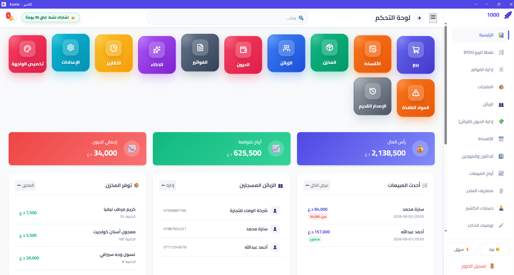

### Point of Sale

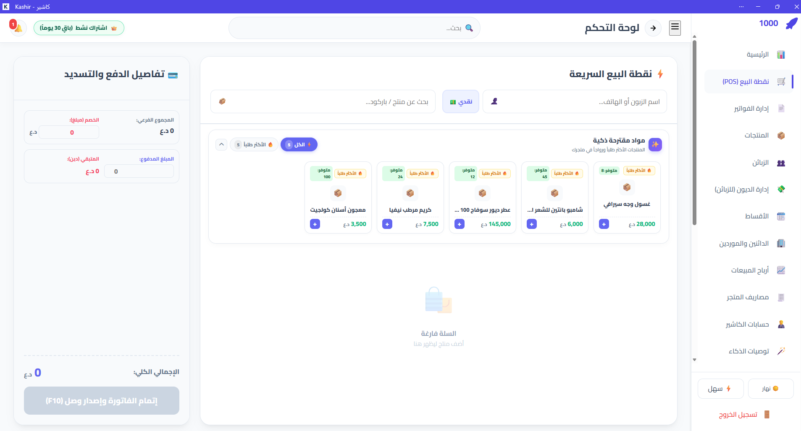

### Products & Inventory

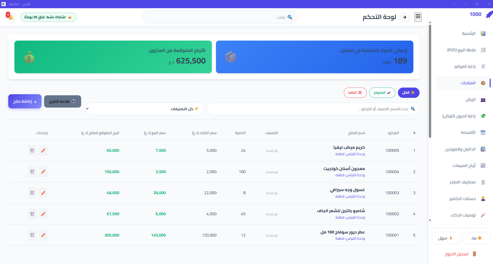

### Customers

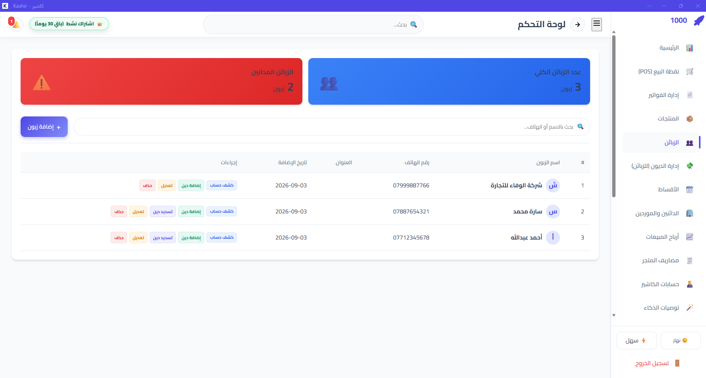

### Debt Management

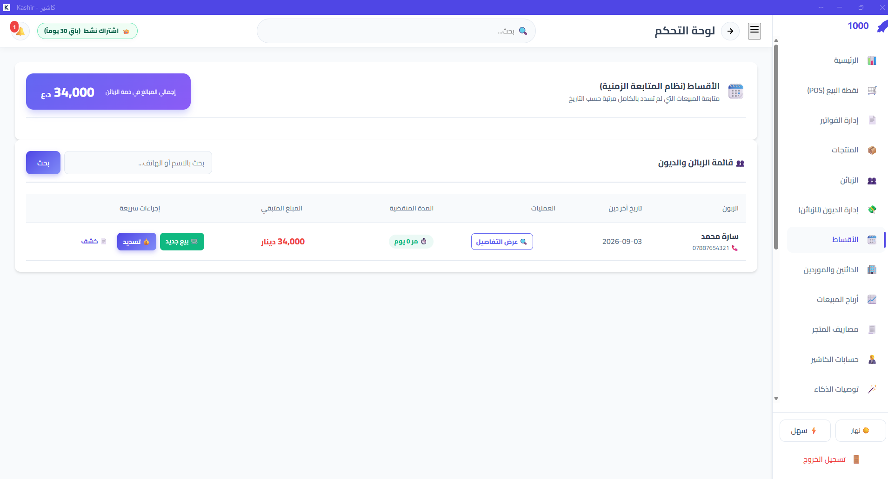

### Business Reports

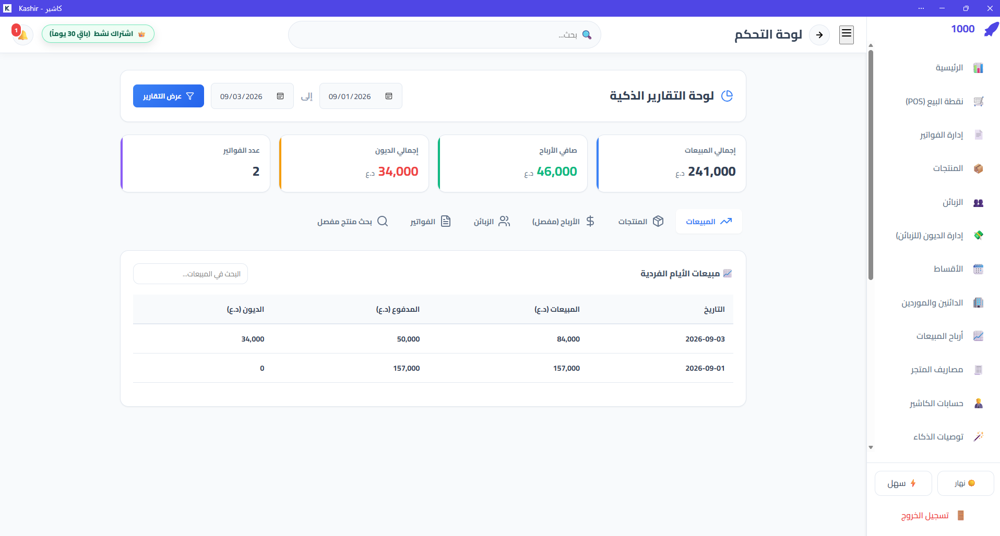

### Online Store

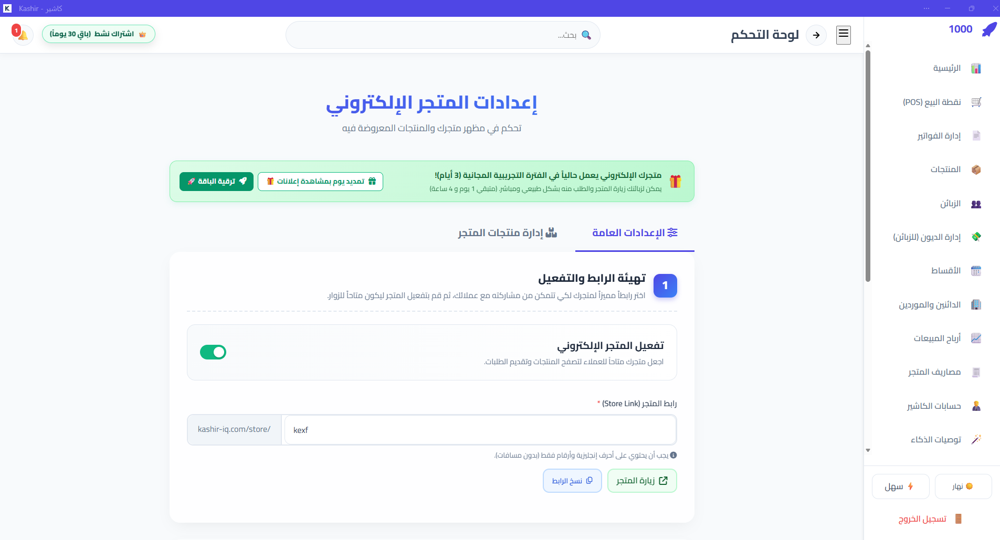

### Referral System

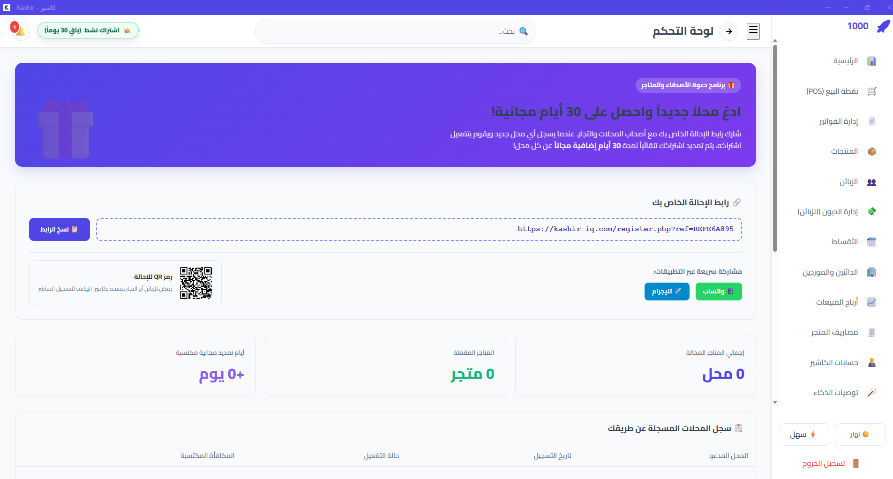

### AI Features

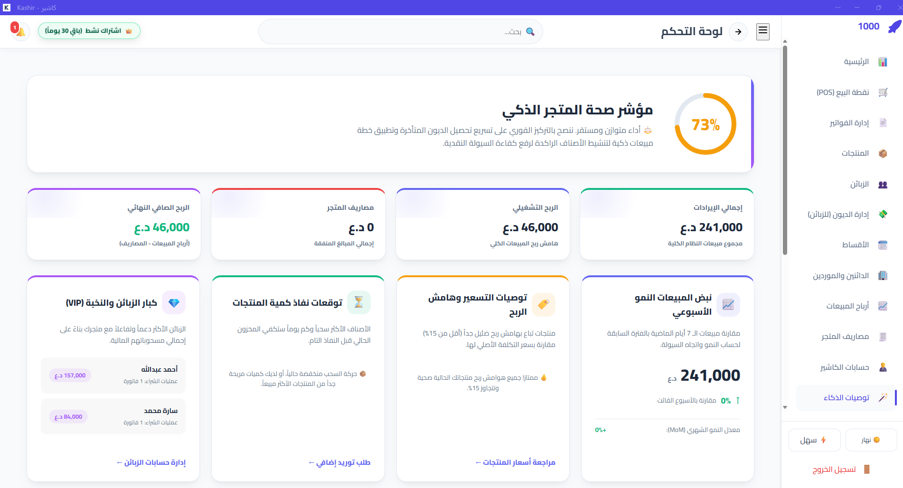

### User Interface

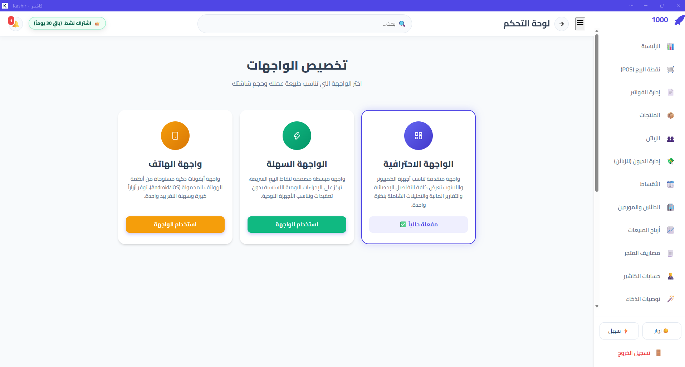

### Navigation

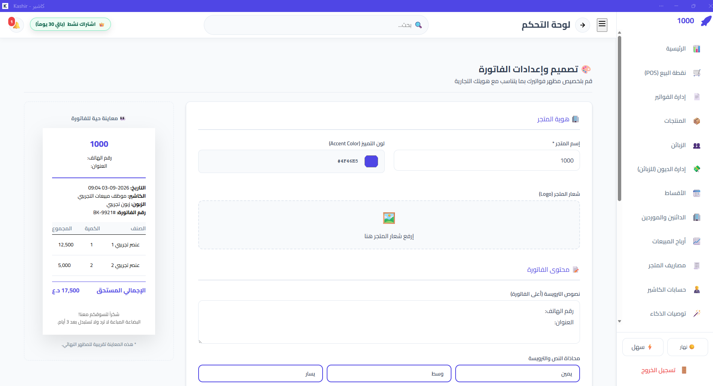

---

## 🏗️ System Architecture

Kashir uses a multi-platform architecture connecting web and mobile clients with a PHP backend, REST APIs, MySQL, Firebase, and external communication services.

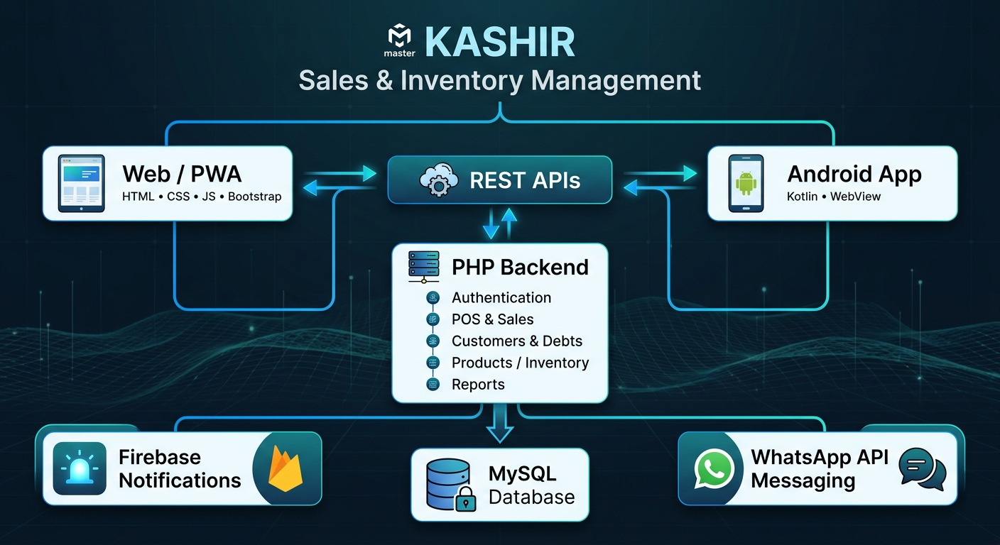

### Architecture Overview

```text
                         ┌──────────────────────────┐
                         │      KASHIR PLATFORM     │
                         │                          │
                         │      PHP Backend         │
                         │      MySQL Database      │
                         └────────────┬─────────────┘
                                      │
                              ┌───────▼───────┐
                              │   REST APIs   │
                              └───────┬───────┘
                                      │
                 ┌────────────────────┼────────────────────┐
                 │                    │                    │
                 ▼                    ▼                    ▼
        ┌────────────────┐   ┌────────────────┐   ┌────────────────┐
        │ Web Application│   │      PWA       │   │ Android App   │
        │ HTML/CSS/JS    │   │ Installable    │   │ Kotlin/WebView│
        │ Bootstrap      │   │ Web Platform   │   │               │
        └────────────────┘   └────────────────┘   └────────────────┘
                 │                    │                    │
                 └────────────────────┼────────────────────┘
                                      │
                    ┌─────────────────┴─────────────────┐
                    │                                   │
                    ▼                                   ▼
             ┌─────────────┐                    ┌──────────────┐
             │  Firebase   │                    │ WhatsApp API │
             │  Services   │                    │ Integration  │
             └─────────────┘                    └──────────────┘
```

---

## 🛠️ Technology Stack

### Backend

* PHP
* MySQL
* REST APIs
* Authentication and access control
* Server-side business logic

### Web

* HTML5
* CSS3
* JavaScript
* Bootstrap

### Mobile

* Android
* Kotlin
* WebView

### Progressive Web App

* PWA technologies
* Installable web application
* Web-based mobile experience
* Offline-oriented capabilities

### Cloud & Services

* Firebase
* WhatsApp API
* REST-based integrations

---

## 📱 Multi-Platform Experience

Kashir is designed to provide a consistent business experience across multiple platforms.

### 🌐 Web Application

A browser-based business management platform accessible from desktop and mobile devices.

### 📲 Progressive Web App

Kashir supports PWA capabilities, allowing users to install and access the platform as a web application.

### 🤖 Android Application

A dedicated Android application developed using **Kotlin**, integrating with the Kashir platform.

### 🔗 WebView Integration

The Android application uses **WebView** to integrate web-based functionality with the native Android environment.

---

## 💬 WhatsApp Integration

Kashir integrates with the **WhatsApp API** to connect business operations with customer communication.

The integration is designed to support workflows such as customer notifications and payment-related communication.

---

## 🔥 Firebase Integration

Firebase is integrated into the Android ecosystem to support application-related services and communication features.

---

## 🤖 AI Features

Kashir includes AI-related functionality designed to enhance the business management experience.

The AI layer is integrated into the existing application architecture rather than operating as an isolated demonstration.


---

## 🛒 Online Store

Kashir includes online store functionality that extends the business platform beyond internal management.

This allows businesses to present products through a digital storefront while maintaining their business data within the same ecosystem.


---

## 🤝 Referral System

Kashir includes a referral mechanism designed to support user acquisition and platform growth.


---

## 👨‍💻 My Role

I designed and developed Kashir across multiple areas of the system.

My responsibilities included:

* Application architecture
* Backend development
* Database design
* Web application development
* Android application development
* REST API development
* Authentication and access control
* Business logic implementation
* WhatsApp API integration
* Firebase integration
* PWA implementation
* WebView integration
* AI feature integration
* Production deployment
* Maintenance and continuous improvement

---

## 🎯 Engineering Focus

Kashir was developed as a **real-world production product**, not only as an academic or demonstration project.

The development process involved practical engineering requirements including:

* Designing business workflows
* Managing business data
* Implementing user permissions
* Connecting web and mobile clients
* Developing REST APIs
* Integrating third-party services
* Supporting multiple application environments
* Handling production deployment
* Maintaining and improving an active product

---

## 🌍 Target Market

| Category           | Details                  |
| ------------------ | ------------------------ |
| Primary Market     | Iraq 🇮🇶                |
| Region             | MENA                     |
| Interface Language | Arabic                   |
| Platforms          | Web + Android + PWA      |
| Product Type       | Business Management SaaS |

---

## 🔗 Project

🌐 **Website:** https://www.kashir-iq.com/

📱 **Android:** Available on Google Play

---

## 🔒 Source Code

Kashir is a commercial production product.

The complete proprietary source code is therefore **not publicly available** in this repository.

This repository serves as a **technical portfolio and case study**, documenting the product architecture, technologies, engineering decisions, features, and development work.

---

## 📌 Project Status

**Status:** Production
**Development:** Active
**Platform:** Web + Android + PWA
**Market:** Iraq

---

## 👨‍💻 Developer

### Mohammed Al-Mousawi

**Computer Engineer | Full-Stack Developer | SaaS Builder**

GitHub:
https://github.com/mohammedinoc-cpu

---

## ⭐ About This Repository

This repository demonstrates the architecture and engineering work behind Kashir while keeping proprietary production source code private.

It is intended to provide technical context for recruiters, employers, collaborators, and potential clients interested in the project.
